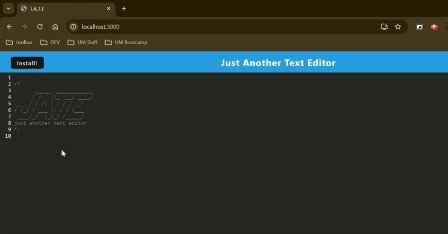

# Just Another Text Editor (JATE)

## Table of Contents

- [Description](#description)
- [Installation](#installation)
- [Usage](#usage)
- [Features](#features)
- [Images](#images)
- [Deployment](#deployment)

## Description

This project is a a text editor project that can be used both on the website and also be installed on your system using Webpack Configuration.

## Installation

To get started with this project, follow these steps:

1. Clone the repository to your local machine:
```bash
git clone github.com/maxmruiz/just-another-text-editor
```

2. Navigate to the project directory:
```bash
cd just-another-text-editor
```

4. Install the necessary dependencies:
```bash
npm install
```

## Usage

To start the application, run the following command in your terminal:
```bash
npm start
```

This will start the server which you can navigate to using `localhost:3000` in your browser.

## Features

In this application, you can use it as an average text editor using the language of your choice.

The key features of this application is that you can use it online via the local host or installing it on your system using it offline.

## Images



## Deployment

If you would like to use this text editor, visit this [link]().
